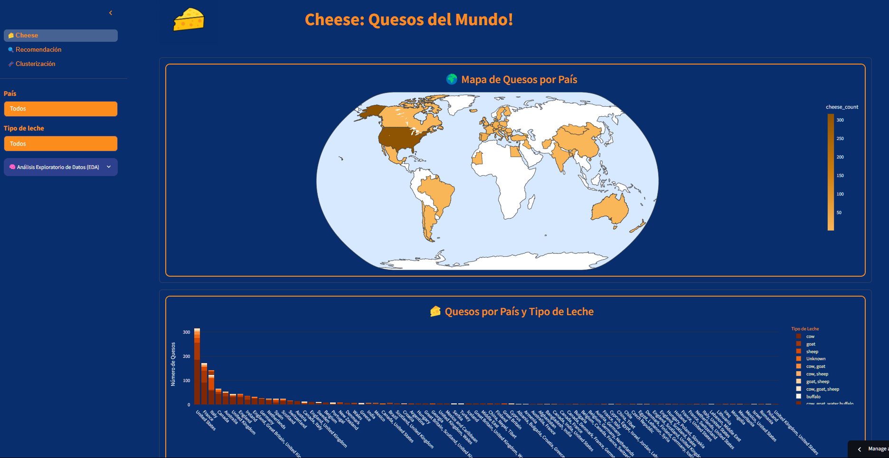
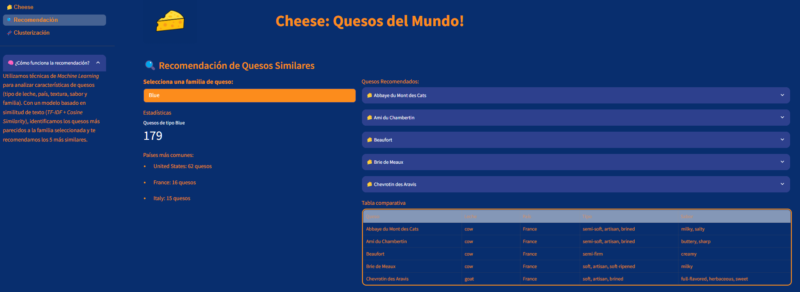
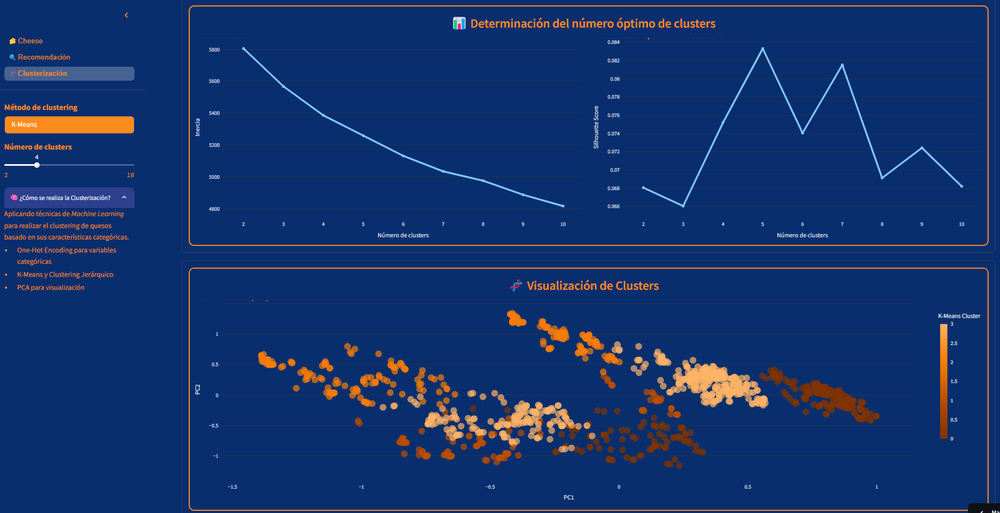

# 🧀 Cheese: Quesos del Mundo!

  
  
  

### **📊 Descripción**: Mi intención con este proyecto fue explorar las funcionalidades de Streamlit, como el diseño multipágina y la personalización visual con CSS, al mismo tiempo que aplicaba Análisis de Datos Exploratorio (ADE) y algunos conceptos de Machine Learning. El resultado es esta app interactiva donde podemos descubrir el mundo del queso desde una perspectiva basada en datos.

---

## 🚀 Live Demo  
- ****

---

## 🤖 Machine Learning  
🧠 **¿Cómo funciona la recomendación de quesos?**
**Apliqué técnicas de Machine Learning para recomendar quesos similares a partir de sus características (tipo de leche, sabor, textura, país y familia) usando:**
 - TF-IDF (Term Frequency–Inverse Document Frequency)
 - Cosine Similarity para identificar los 5 quesos más parecidos al seleccionado.

🧠 **¿Y la clusterización?**
**Realice la agrupación usando:**
 - One-Hot Encoding (para convertir variables categóricas)
 - Aplicando K-Means y/o Clustering Jerárquico
 - PCA para visualizar los clusters en 2D

---

## 🛠️ Tools & Technologies  
- **Python/Streamlit:** Para construir el diseño de la aplicación interactiva, realizar analisis de datos y aplicar modelos de Machine Learning.  
- **Librerias:** Pandas, NumPy, Scikit-learn, Matplotlib, Seaborn, Plotly.  

---

## 📈 Resultados  
✔ **Origen**: La mayoría de los quesos provienen de Estados Unidos y Europa, especialmente Francia e Italia.
✔ **Tipos de Leche**: La leche de vaca es la más usada, seguida por la de cabra y oveja.
✔ **Familias**: El análisis de sabor y textura muestra familias bien diferenciadas.
✔ **Aromas**: La nube de palabras destaca perfiles como cremoso, afrutado e intenso.

## 📈 Key Results  
✔ **Identified global trends**: Some songs and artists dominate multiple countries.  
✔ **Discovered cultural preferences**: Certain songs are uniquely popular in specific regions.  
✔ **Analyzed musical characteristics**: Features like **danceability** and **energy** drive song popularity. 

---